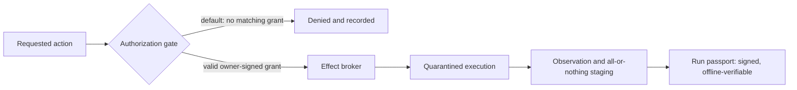

# Deedseal

[](https://github.com/deedseal/deedseal/actions/workflows/validate-public-record.yml)

Deny-by-default execution control for AI coding agents on Linux, with a signed, offline-verifiable passport for every run.

Deedseal is designed so that what a machine was allowed to do — and what it actually did — can be proven later, offline, without trusting the machine that did it.

In plain terms: before an AI coding agent runs, the owner signs a permission slip naming exactly which files it may change. The kernel holds that boundary while the agent works. Afterwards, a signed passport records what was permitted and what happened — and anyone can check that passport on their own machine, offline, without asking us.

## Verify it yourself

Two real run passports, their one-byte tampered twins, and the offline verifier are published in this repository ([run index](examples/verified/runs.md)). The quick check below uses the first published run: its passport verifies `PASS`, while its twin verifies `BLOCK`. Pick the path that fits you:

- **Browser only.** Watch the [Actions tab](https://github.com/deedseal/deedseal/actions) re-prove both verdicts on every change — or fork the repository, change one character of the passport in the web editor of your fork, and watch the proof break — the check named `Re-prove the published demonstration` fails within about two minutes of your edit.
- **Ask your AI assistant** to clone the repository and run `python3 tools/check_demonstration.py`, then to tamper one byte of a passport copy and verify it again — it should report `PASS`, then `BLOCK` with a named reason for your tampered copy.
- **Terminal**, offline, standard Python only:

```
python3 tools/verify_run_passport.py examples/verified/run-passport.json
python3 tools/verify_run_passport.py examples/verified/run-passport.tampered.json
```

The command against `examples/verified/run-passport.json` must end with:

```
RUN_PASSPORT_VERDICT: PASS
```

and exit `0`. The second must end with:

```
RUN_PASSPORT_VERDICT: BLOCK block_owner_authorization_signature_invalid
```

and exit `1`. One byte of difference between the two files is the entire reason for the different verdicts.

What a PASS proves, what it does not, and how to check the changed file's bytes against the passport's signed digests: [docs/verify.md](docs/verify.md).

## This repository

This repository is the public documentation and machine-validated evidence record for Deedseal. The engineering repositories stay private — what is published here is the record, not the source.

One deliberate exception: the offline run-passport verifier is published in full, so that checking a passport never requires trusting us. The reasoning is recorded in [decision 0006](docs/decisions/0006-publish-the-verifier-under-apache-2.md).

In depth: [architecture](docs/architecture.md) (how the pieces fit), [trust model](docs/trust-model.md) (what is assumed, threatened, and out of scope), [system boundary](docs/system-boundary.md) (the engineering lifecycle around a run).

## What Deedseal is

Four properties. Each one is enforced by the system and recorded in the run passport — none is a promise.

- **Deny-by-default authority.** Every action is matched against explicitly enumerated allow paths; anything unmatched — an unknown action type, an ambiguous scope, a self-approval attempt — is blocked and recorded.
- **One canonical path.** A signed work grant, checked at a single authorization gate, executed through a single effect broker. There is no second door.
- **A signed passport for every run.** Each supervised run closes into a single evidence record binding the grant, the execution, and the complete resulting changeset — verifiable offline by anyone holding the verifier.
- **The owner decides.** Automation and AI tooling implement and propose; approval, merge, and signature stay with one human. Self-approval is rejected outright.

## Who this is for

- Engineers who let AI coding agents change real repositories and want the allowed scope enforced and recorded rather than assumed.
- Reviewers and auditors who are handed machine-made changes and need an answer to "what else could it have touched?" that does not depend on the agent's own account.
- Anyone evaluating this project: every claim in the table below is labelled with exactly what you can and cannot reproduce yourself.

## What Deedseal is not

- **Not an agent framework.** Deedseal does not run, prompt, or orchestrate agents; it is the authority layer an agent runs under.
- **Not a sandbox.** Deedseal governs what a run is allowed to change and proves what it did change. To contain hostile code, compose it with a sandbox or a virtual machine (gVisor, Firecracker, or similar).
- **Not an audit log or a SIEM.** A log is trusted because of where it sits. A run passport carries its own verifiability wherever it travels.
- **Not a policy linter.** The gate does not advise; it decides, and its default is no.

## How a permitted action runs

One path, five stations, no second door:

An agent's requested action reaches the authorization gate. The gate checks it against a signed work grant, issued and signed offline by the owner, which pins the repository state, a short validity window, and the exact set of files the run may change. Anything outside an enumerated allow path is denied and recorded. Permitted work executes in a disposable quarantine under a separate operating-system principal; the result is observed byte for byte, and only the observed bytes are staged, all or nothing. The run then closes into a signed passport.



## The run passport

A run passport is one JSON record per supervised run, binding what was requested, what was granted, and what actually changed — including the complete changeset of the resulting commit, which must exactly equal the granted file set. It is signed twice on the way through: by a dedicated service key before and after execution, and by the owner as closure.

**Offline verification.** Checking a passport requires the verifier — a single standard-library Python file with its trust anchors baked in — and the passport itself. No network, no running service, no access to the machine that produced it. See [docs/passport.md](docs/passport.md) and a [synthetic example passport](examples/passport.example.json). To run the checks yourself, see [Verify it yourself](#verify-it-yourself) above.

## Verified claims

Beyond documentation, this repository maintains a machine-validated public record: bounded claims tied to a dated snapshot, each backed by a sanitized evidence record, with statuses that say exactly what a public reader can and cannot reproduce. Structure, cross-references, artifact digests, and disclosure rules are checked by CI on every change.

`internally-verified` means the property was checked against a fixed private-source snapshot; it is evidence of internal verification, not independent certification.

| Claim | Statement | Evidence | Status |
|---|---|---|---|
| `CLM-0001` | A run can be admitted by a signed, scope-bound owner grant before controlled effects are accepted. | `EVD-CORE-0001` | `internally-verified` |
| `CLM-0002` | A current run passport binds authorization, custody outcome, execution identity, complete committed changes, artifact hashes, acceptance data, and final owner closure. | `EVD-CORE-0001` | `internally-verified` |
| `CLM-0003` | The standalone run-passport verifier needs one passport file and no network, repository checkout, running service, private key, or third-party Python package. | `EVD-CORE-0001` | `internally-verified` |
| `CLM-0004` | Repository-native dispatch binds immutable task bytes, bounded write scope, an execution-profile digest, and draft-only automation authority to an owner-selected commit. | `EVD-OFFICE-0001` | `internally-verified` |
| `CLM-0005` | Postflight checks worker history and scope before publication; readiness, approval, and merge remain owner actions. | `EVD-OFFICE-0001` | `internally-verified` |
| `CLM-0006` | Typed interruptions and recorded failures receive terminal dispositions; retry admits a closed failure set and reclaims prior worker state. | `EVD-OFFICE-0001` | `internally-verified` |
| `CLM-0007` | An internal 10-entry controlled-execution series records eight positive lifecycles and two designed-negative lifecycles refused before effects. | `EVD-CORE-0002` | `internally-verified` |
| `CLM-0008` | A published run passport verifies PASS with the published offline verifier, and a one-byte tampered copy verifies BLOCK, using only this repository's files and a Python interpreter. | `EVD-CORE-0003` | `public-reproducible` |
| `CLM-0009` | A second controlled run produced the precommitted target bytes, proved staged-to-materialized equality, and published those exact result bytes in this repository. | `EVD-CORE-0004` | `internally-verified` |
| `CLM-0010` | The published verifier declares 39 refusal reasons; the published mutation corpus demonstrates 35 exact refusal verdicts and classifies 4 as not reachable by mutation of the published bytes. | `EVD-PUBLIC-0001` | `public-reproducible` |
| `CLM-0011` | The boundary recorded in the published passport, applied on an unrelated Ubuntu runner's kernel, permits the recorded file write and refuses file creation, directory creation, symbolic-link creation, and unlink; continuous integration re-observes these operations on Ubuntu on every change. | `EVD-PUBLIC-0002` | `public-reproducible` |
| `CLM-0012` | A second supervised run is published with its passport, its one-byte tampered twin, and the exact before and after bytes of the file it changed; the passport verifies PASS and the twin verifies BLOCK using only this repository's files and a Python interpreter. | `EVD-CORE-0005` | `public-reproducible` |
| `CLM-0013` | Two implementations of the published run-passport envelope produce identical verdicts and exit codes on all 48 published conformance vectors, and continuous integration re-observes this on every change. | `EVD-PUBLIC-0003` | `public-reproducible` |

Claim boundaries and non-claims: [docs/engineering-properties.md](docs/engineering-properties.md). Evidence model and what the hashes prove: [evidence/README.md](evidence/README.md). What may be published at all: [docs/publication-policy.md](docs/publication-policy.md).

## Principles

- **Deny by default.** Every allow path is enumerated; the fallthrough is a block.
- **One path for authority.** All effects go through the gate and the broker — no bypass path, no override channel, no route by which automation can sign.
- **Machines implement; the owner decides.** AI workers author and propose; approval, merge, and signature stay with one human.
- **Prefer sealed evidence to inference.** Claims about a run are read from signed records, never from the run's own account of itself.
- **Verification must not require trusting us.** The verifier is one auditable file with its keys baked in; nothing in the input can substitute a trust anchor.

## What Deedseal does not do

Deedseal does not sandbox the workload itself. To run possibly-malicious code, pair it with an appropriate sandbox or virtual machine. Deedseal does not protect against a compromised kernel or a compromised owner key. Grant-derived filesystem confinement of the agent process is applied by the kernel and recorded in the published passport ([docs/verify.md](docs/verify.md)); resource and egress bounds remain open objectives tracked in [docs/status.md](docs/status.md).

## Status

Deedseal is in active development. The authorization, signing, quarantine, custody, and offline-verification chain is implemented and has been exercised end to end in development. The published passport envelope is frozen under a stated compatibility commitment ([specification](docs/passport-spec-v1.md)); Deedseal is not yet available for production use. Current workstreams and their state are tracked in [docs/status.md](docs/status.md).

## How Deedseal is built

The discipline that governs runs also governs the codebase: AI workers implement inside bounded task packets with pinned scope, acceptance is an ordered suite of deterministic checks — about half of them hostile probes that must fail for the right reason — and only the owner merges. The method is documented in [docs/method.md](docs/method.md). Significant decisions about this public repository are recorded in [docs/decisions/](docs/decisions/README.md). This public repository is itself young — published 2026-08-01 — and much of it was authored by AI workers under the method it documents; the commit history shows which commits were machine-authored and that every merge is the owner's.

## FAQ

Short answers to the questions readers actually ask — "Why not just seccomp?", "How is a passport different from an audit log?", "Can I use it today?" — are in [docs/faq.md](docs/faq.md).

## Security

Report vulnerabilities through GitHub private vulnerability reporting on this repository. Details: [SECURITY.md](SECURITY.md).

## Questions and contributions

Questions are welcome as GitHub issues. Pull requests are accepted for corrections and clarity only; feature and design proposals cannot be accepted here, because the engineering repositories are private. This repository operates under the same model as the product: automation may propose; only the owner reviews, approves, and merges. See [CONTRIBUTING.md](CONTRIBUTING.md).

## Brand

The mark, the lockup, and the palette are documented in [assets/README.md](assets/README.md), with generators that reproduce every asset from source.

## License

Documentation in this repository is licensed under [CC BY 4.0](LICENSE); executable files declare their own license with an SPDX identifier. The underlying product source is private and not covered by that license; see [NOTICE.md](NOTICE.md).

## Where to go next

- [docs/verify.md](docs/verify.md) — run the verification yourself, three ways, with expected outputs.
- [docs/passport.md](docs/passport.md) — what a run passport binds and what the verifier checks.
- [docs/trust-model.md](docs/trust-model.md) — what is assumed, what is threatened, what is out of scope.
- [docs/status.md](docs/status.md) — what is shipped, what is open, dated updates.
- [docs/faq.md](docs/faq.md) — the obvious questions, answered plainly.
