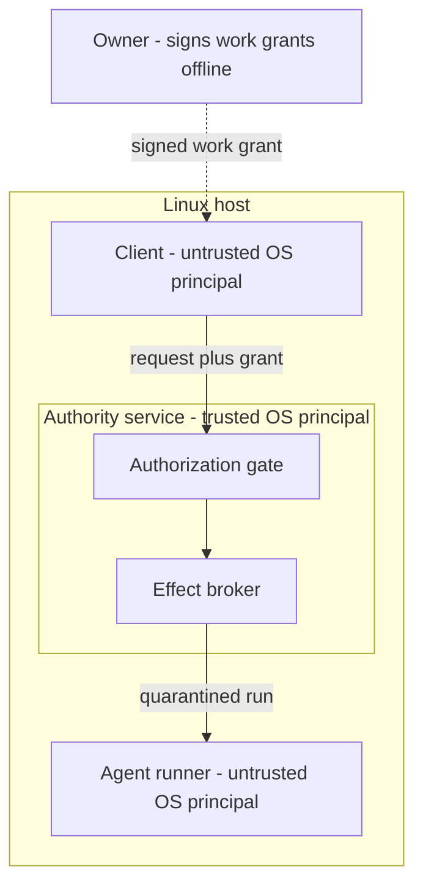
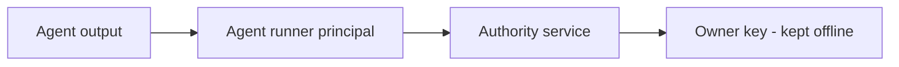

# Architecture

This document describes concepts, not implementation. Interfaces shown here are illustrative and not frozen.

## Where Deedseal sits

Deedseal runs on a Linux host, between an AI coding agent and the repository the agent is allowed to change. The owner signs authorization offline; the host enforces it.

## The canonical path: grant, gate, broker

### Signed work grants

A grant is an authorization signed offline by the owner with a fixed, non-negotiable signature algorithm (Ed25519); a grant that declares any other algorithm is refused. The grant format is versioned, and each version additively binds more scope into the signed payload: a single-use nonce, a strict validity window with a hard 30-minute cap, the run identity and the exact repository head, the exact set of files the run may change, the exact task prompt text the agent will be given, and a data-only acceptance contract whose expected changed paths must equal the granted files. The signature version lives inside the signed payload, so a grant cannot be weakened by presenting it as an older version. Freshness is checked against the service's own clock and dispatch context, never against caller-supplied values. Signing tooling refuses key files stored inside a repository and validates the key file on the open file descriptor before use.

### The authorization gate

The gate is the single authorization decision point, and its default answer is no. It blocks first: requests carrying self-approval or negotiation fields are rejected outright; unknown action types are rejected against a closed set; ambiguous or blanket scopes — "do whatever is needed" — are rejected as a distinct block reason. Allow paths are individually enumerated, from read-only actions up to protected actions that require an owner-signed grant and full evidence. The final fallthrough is a block.

### The effect broker

The broker is the only code path that produces physical effects. It rejects any request envelope containing callable values or hook-like keys before evaluation, builds the operation from a small closed registry of operation types, and verifies that the gate's decision matches the operation it is about to perform — a decision for one operation cannot be replayed against another. It then applies second-line containment of its own: file writes must resolve inside the granted scope; subprocess argument vectors must byte-equal a committed contour, with no shell interpretation; credentials reach the broker only through explicit environment configuration, never through request content.

## Three operating-system principals

Runs execute under three separate OS principals rather than one process trusting itself:

- **The authority service** (trusted) — sole owner of the state root and its socket. It authorizes, observes, signs, and stages.
- **The agent runner** (untrusted) — the principal that actually executes the coding agent. It keeps network egress, because the agent must reach its model provider; that egress is precisely why it is treated as untrusted.
- **The client** (untrusted) — the principal that submits work, admitted by group membership.

Peer identity across these boundaries is the kernel's answer (`SO_PEERCRED`), never a field in a request. The runner's report format has no verdict field: runner exit 0 is necessary but never sufficient, and the authority independently re-observes the repository head, the working tree, and the quarantine. An admission predicate refuses degenerate topologies outright — for example, a client and service sharing a UID.

## Quarantine and immutable-byte promotion

Agent edits happen only inside disposable quarantine directories created by the authority. Observation is a file-descriptor-relative traversal that re-verifies file identity before and after every read; symlinks, hardlinks, special files, oversized files, and over-deep trees all fail closed. The observed file set must exactly equal the granted file set: a superset blocks with zero staging, and a subset blocks as incomplete.

Promotion consumes only the immutable byte snapshots taken during observation — never a pathname the agent controlled — so substituting a file after observation still promotes the originally observed bytes. Staging is all-or-nothing behind a single atomic rename. A separate owner-side step materializes staged changes into a working tree, and it is gated on offline verification of the signed success record.

## What is deliberately absent

There is no bypass path around the gate. There is no administrative override channel. There is no route by which automation can sign anything. These are not roadmap gaps; they are design decisions.

## Trust boundaries

Zones ordered least-trusted to most-trusted. Everything the agent produces — code, files, reports, claims of success — sits in the least-trusted zone until it has passed the gate and been observed. The owner's signing key never enters the host path that runs agents.

For the threat model behind these boundaries, see [trust-model.md](trust-model.md). For the engineering lifecycle around this runtime — dispatch, isolated workers, draft-only publication, owner review — see [system-boundary.md](system-boundary.md).
