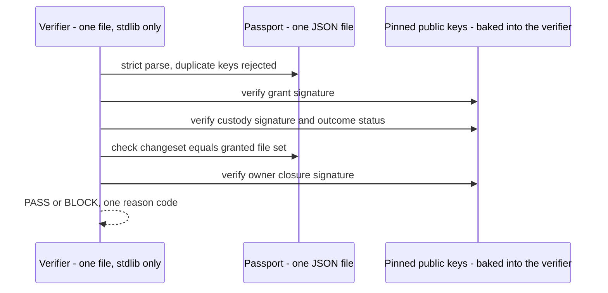

# The run passport

## What is a run passport?

A run passport is a sealed record of one supervised run: what was requested, what was granted, and what actually changed. It is one JSON file, signed so that it can be checked later — by anyone holding the verifier — without asking the machine that produced it, and without trusting that machine.

## What a passport binds

- **The signed work grant.** The owner's offline signature over the run's authorization: pinned repository state, validity window, the exact allowed file set, the exact task prompt text.
- **The signed custody record.** A service-signed record that authorization existed *before* any effect, and a signed outcome record after. The custody key is deliberately not the owner's key: a service that could sign with the owner's key would be a service that could mint owner authority.
- **The observed changes.** Per-file before and after digests taken from the quarantine observation — the immutable bytes that were actually staged.
- **The complete changeset.** The resulting commit's full changed-path set, which must exactly equal the granted file set, with per-file hashes. A passport cannot present a flattering subset of what happened.
- **The owner's closure signature.** The owner signs the assembled core as the final act. The closure cannot launder an unverified claim: signing tooling refuses to countersign a summary that disagrees with the signed custody record.
- **The applied kernel write boundary.** The filesystem rights the kernel denied by default, the exact files re-permitted, and the one recorded scratch class — bound to the digest of the grant they were derived from.

## Verifying a passport

The verifier checks in a fixed order and stops when a check fails. The main links are:

1. Strict parse — malformed JSON and duplicate keys are rejected.
2. The grant signature, against a pinned owner key.
3. The custody signature, against a pinned service key.
4. The authenticated outcome status — it must be exactly a success. A validly signed failure can never verify as a success.
5. The changeset — the changed-path set must exactly equal the granted file set.
6. The owner's closure signature over the assembled core.

The verdict is a single fail-closed answer: PASS, or BLOCK with one reason code.

## Offline verification

The verifier is a single, self-contained, standard-library Python file. Its trust anchors — the public keys — are baked into the file as literals. It takes exactly one argument: the passport. No flag, no environment variable, and no field inside the passport can substitute a key; a public key carried inside a record is treated as attacker-controlled data.

Note what this diagram does not contain: no network, no running service, no producing host. Verification needs none of them — no git, no repository checkout, no private key.

The verifier is published here as [`tools/verify_run_passport.py`](../tools/verify_run_passport.py) under Apache-2.0, together with a real passport and a byte-tampered twin, per [decision 0006](decisions/0006-publish-the-verifier-under-apache-2.md). Run it yourself: [verify.md](verify.md).

## What verification proves — and what it does not

A passing passport proves process and provenance: the run was authorized by the owner before it happened, the effects stayed inside the granted scope, the evidence chain is intact, and nothing was substituted after observation.

It does not prove that the code change is semantically correct, and it does not prove the workload was sandboxed. Correctness review remains the owner's job; containment is a separate layer.

A passport that does not verify is treated as no passport at all — deny by default applies to evidence too.

## Format status

The published envelope is frozen: a passport carrying it will keep verifying, and new capability arrives as a new version rather than a silent change to this one. The exact commitment and its limits are in [Run passport specification v1](passport-spec-v1.md), which is where an implementer should start. The structure described on this page and the [synthetic example](../examples/passport.example.json) are illustrative; the specification is authoritative.

The passport-binding and offline-verification properties described here are registered as claims `CLM-0002` and `CLM-0003` in the [public evidence record](engineering-properties.md), with their evidence class and limitations stated there.
