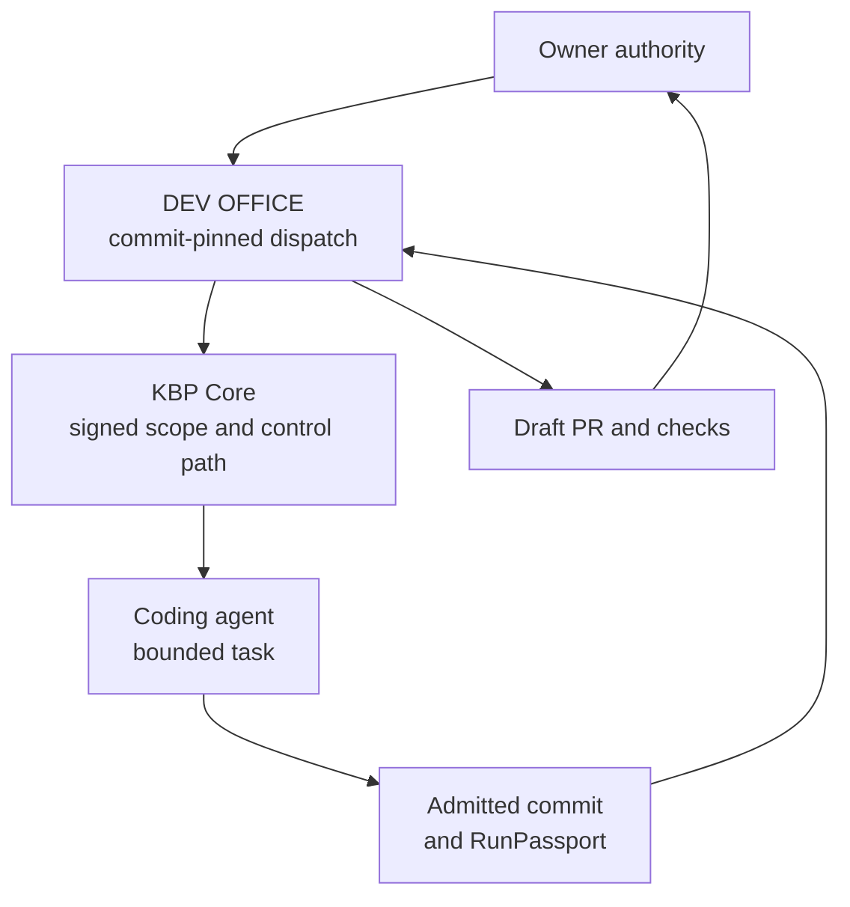

# System boundary

## Purpose

Deedseal describes a controlled engineering path for AI coding-agent work. The
system treats a run as an authority event with a beginning, a bounded execution
surface, an admitted result, and a reviewable terminal record.

The diagram is conceptual. It intentionally omits host topology, credentials,
principal names, key identifiers, transport details, filesystem paths, and
private repository coordinates.

## Component responsibilities

### KBP Core

The Core component owns the product control and proof path:

1. admit an owner-authorized, data-only run scope;
2. check requested effects through a deterministic gate and execution broker;
3. observe and admit the resulting change set within the declared boundary;
4. bind authorization, execution, committed artifacts, acceptance, custody
   outcome, and owner closure into a RunPassport;
5. return a deterministic offline verdict for that passport.

The coding agent is not the authority core. Agent output is treated as candidate
work until it passes the control and admission path.

### DEV OFFICE

DEV OFFICE owns the engineering work lifecycle around the Core:

1. commit a task packet and machine-readable dispatch manifest;
2. bind the packet, target state, write scope, execution profile, and authority
   boundary;
3. run the worker in an isolated work area;
4. verify worker history, changed paths, acceptance output, and publication
   preconditions;
5. publish a Draft pull request and observe required checks;
6. leave readiness, approval, and merge to the owner.

At `DS-2026.08.1`, this actuator path is an implemented and hermetically tested
engineering capability. Production adoption remains pending, and this document
does not claim a real provider run through that actuator.

Durable repository state is authoritative. Chat, model memory, transient
terminal sessions, and uncommitted work are not completion records.

### Deedseal public record

This repository is downstream of both private components. It may publish:

- stable, sanitized architecture descriptions;
- narrowly worded claims tied to a dated public snapshot;
- aggregate test or run summaries that clear disclosure review;
- public schemas and validation logic for the publication itself.

It does not publish private source, raw run artifacts, operational topology,
credential material, task prompts, internal attack details, or unresolved
security work.

## Meaning of the boundary

The current claims concern authorization, provenance, scope, custody, commit
binding, publication discipline, and offline verification within the documented
execution path. They do not establish semantic correctness of generated code or
control over activity outside that path.
