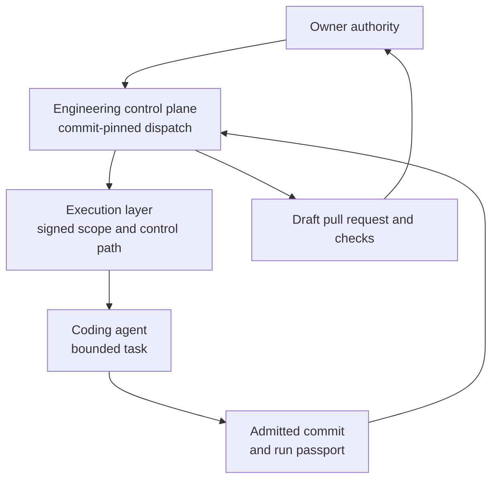

# System boundary

## Purpose

Deedseal treats an AI coding-agent run as an authority event with a beginning, a bounded execution surface, an admitted result, and a reviewable terminal record. This document describes the boundary between the private engineering layers and this public repository, and the lifecycle a piece of work travels through.

The runtime mechanics of a single run — grant, gate, broker, quarantine — are described in [architecture.md](architecture.md). This document describes the engineering loop around them.

The diagram is conceptual. It intentionally omits host topology, credentials, principal names, key identifiers, transport details, filesystem paths, and private repository coordinates.

## Component responsibilities

### The execution layer (private)

The execution layer owns the product control and proof path:

1. admit an owner-authorized, data-only run scope;
2. check requested effects through a deterministic gate and effect broker;
3. observe and admit the resulting change set within the declared boundary;
4. bind authorization, execution, committed artifacts, acceptance, custody outcome, and owner closure into a run passport;
5. return a deterministic offline verdict for that passport.

The coding agent is not the authority core. Agent output is treated as candidate work until it passes the control and admission path.

### The engineering control plane (private)

The control plane owns the work lifecycle around the execution layer:

1. commit a task packet and machine-readable dispatch manifest;
2. bind the packet, target state, write scope, execution profile, and authority boundary;
3. run the worker in an isolated work area;
4. verify worker history, changed paths, acceptance output, and publication preconditions;
5. publish a draft pull request and observe required checks;
6. leave readiness, approval, and merge to the owner.

The worker itself holds no repository credential. Publish authority activates only after independent postflight verification passes, and it extends to opening a draft pull request — nothing further.

At `DS-2026.08.1`, this dispatch path is an implemented and hermetically tested engineering capability. Production adoption remains pending, and this document does not claim a real model-provider run through that path.

Durable repository state is authoritative. Chat, model memory, transient terminal sessions, and uncommitted work are not completion records.

### The Deedseal public record (this repository)

This repository is downstream of both private layers. It may publish:

- stable, sanitized architecture descriptions;
- narrowly worded claims tied to a dated public snapshot;
- aggregate test or run summaries that clear disclosure review;
- public schemas and validation logic for the publication itself.

It does not publish private source, credential material, internal attack details, or unresolved security work. One raw run artifact is published deliberately — the demonstration passport under `examples/verified/`, which carries its own grant, custody record, task prompt, nonce, and the quarantine paths of that run; that disclosure was reviewed once and is the exception, not the rule.

## Meaning of the boundary

The current claims concern authorization, provenance, scope, custody, commit binding, publication discipline, and offline verification within the documented execution path. They do not establish semantic correctness of generated code or control over activity outside that path.
